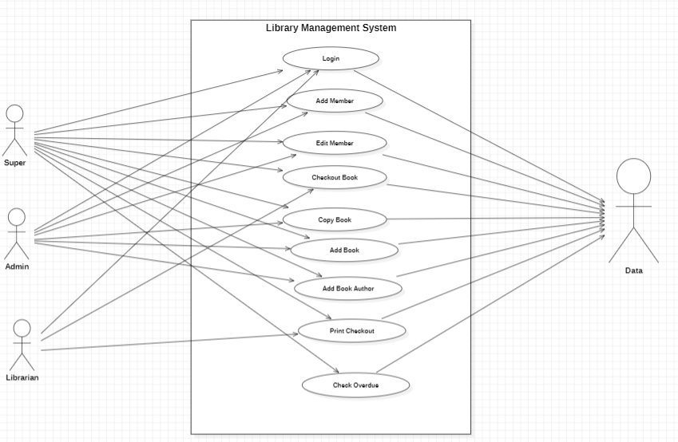
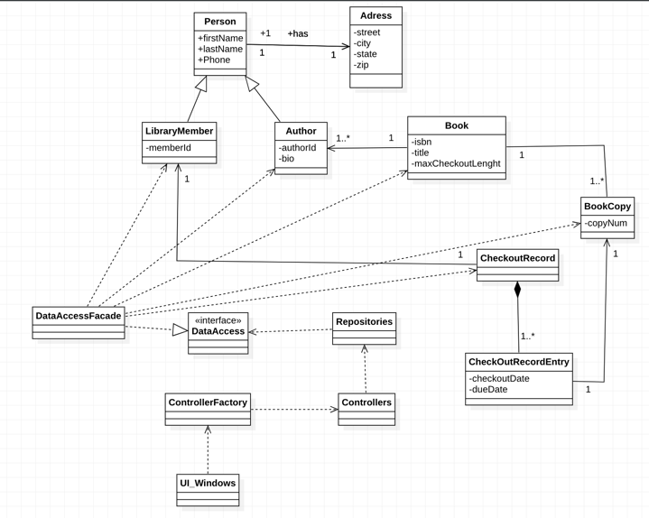
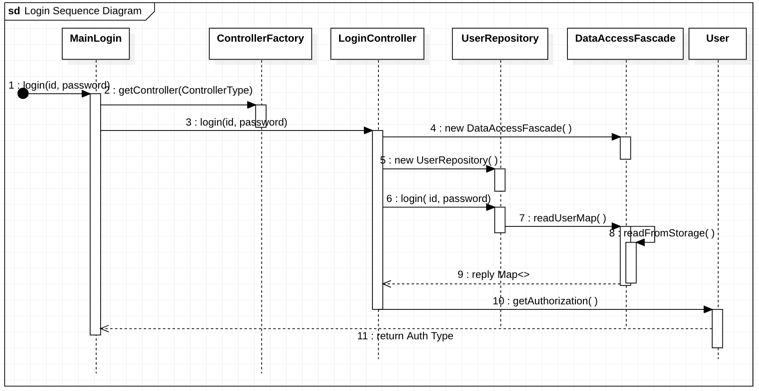
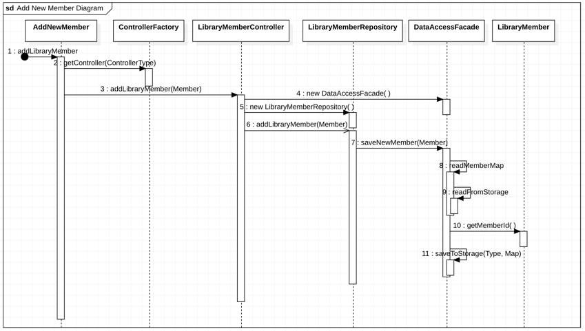
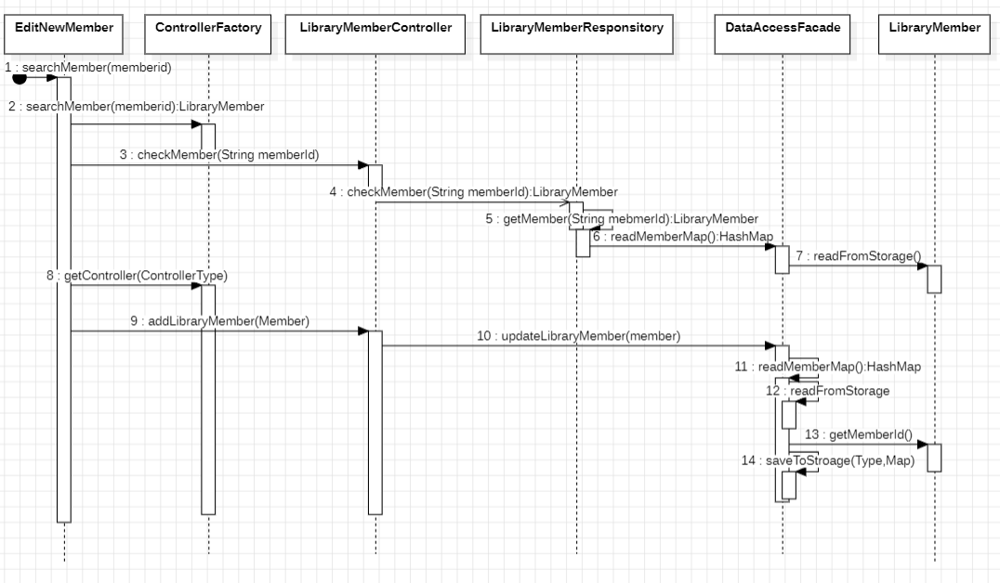
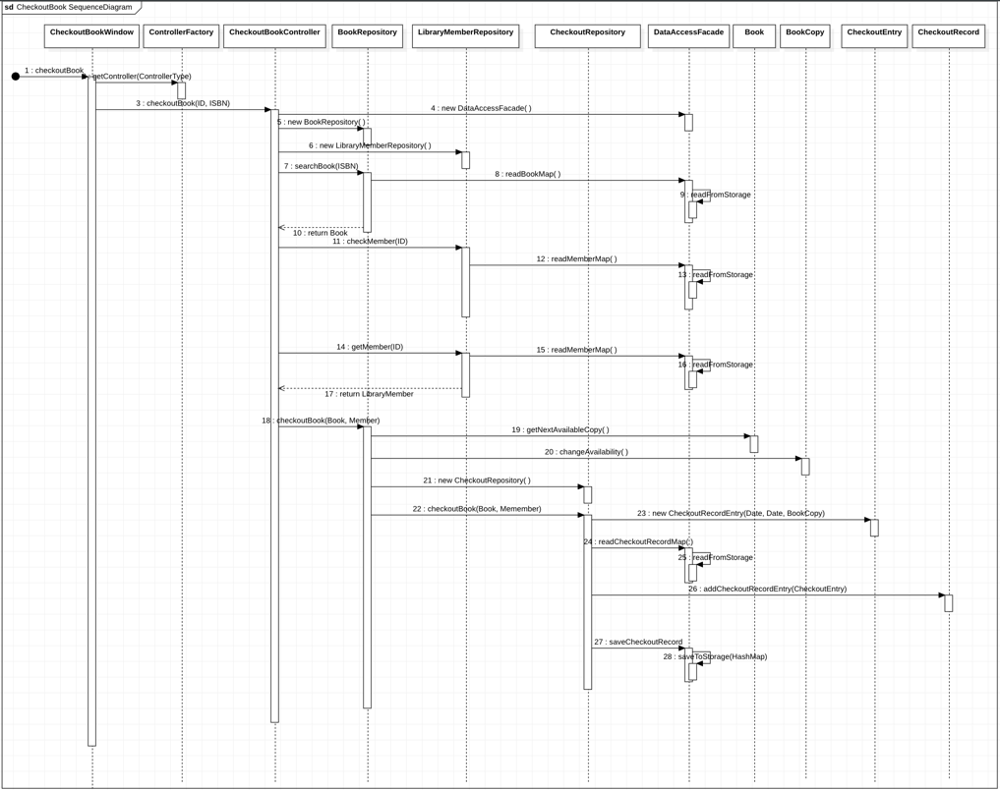
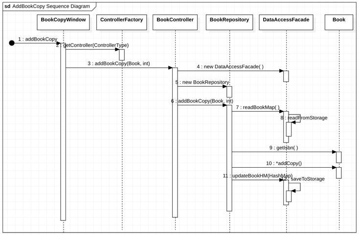
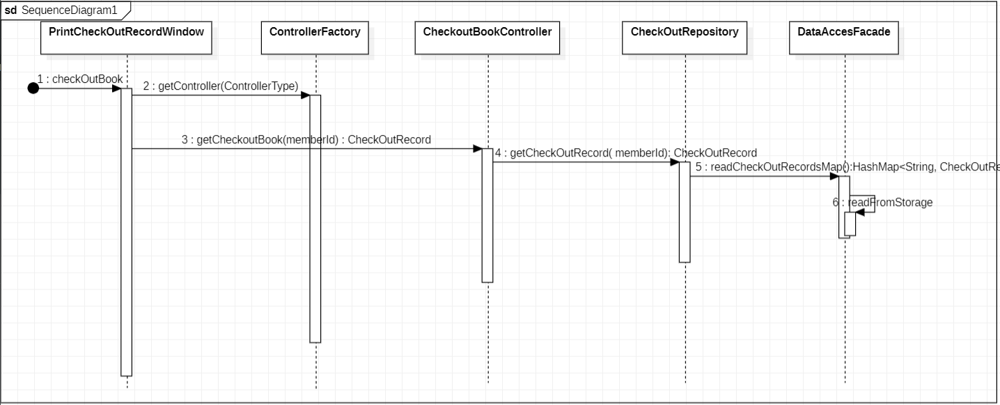
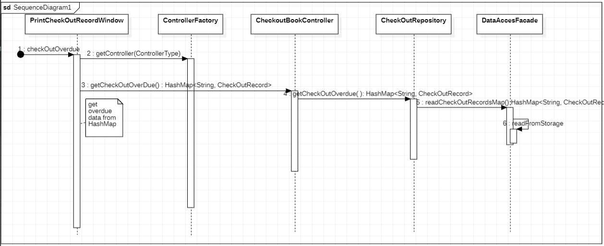

# Project Name: Library Management System
# Group-III
# Group Name-Apple
# Group Member
 * Yee Min Chow
 * Hsu Min Htet
 * Thiri Mon

## *****Static Diagrams of the Project***** ##
### **1. Usecase Diagrams**
 

### **2. Class Diagram**

## *****Dynamic Diagrams of the Project(Sequence Diagram)***** ## 
### **1.Login **

### **2.Add Member **

### **3.Edit Member **

### **4.Checkout Book **

### **5.Copy Book **

### **6.Add Book (Bonus_1) **

### **7.Add Book Author **
.............................
### **8.Print Checkout (Bonus_2) **

### **9.Check OverDue (Bonus_3) **

   